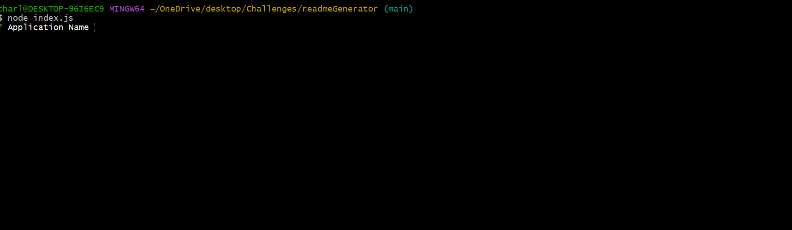

<!DOCTYPE md>
# Readme Generator

## Description:
Creates a readme file

## Technologies:
node js and javascript

## Instalation Instructions:
Run the index.js from the terminal

## Link to github:
link to github: https://github.com/cdthe1nonly1/readmeGenerator.git

## Link to application
link to Readme Generator webpage: N/A

## Images:
Image Link 

## Contributing
None

## Tests
No

## Usage:

This application for automatically creating a readme file.

## Licences:

none